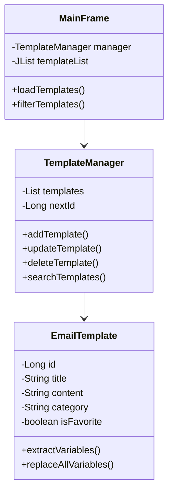

# SmartEmailTemplateAssistant
# 📧 Smart Email Template Assistant

<div align="center">
  
  
  
  
</div>

<div align="center">
  <h3>🚀 반복적인 이메일 작성 시간을 80% 단축시켜주는 스마트한 템플릿 관리 도구</h3>
</div>

## 📌 목차
- [소개](#-소개)
- [주요 기능](#-주요-기능)
- [시작하기](#-시작하기)
- [사용 방법](#-사용-방법)
- [프로젝트 구조](#-프로젝트-구조)
- [기술 스택](#-기술-스택)
- [기여하기](#-기여하기)
- [라이센스](#-라이센스)

## 🎯 소개

Smart Email Template Assistant는 비즈니스 환경에서 반복적으로 작성되는 이메일을 효율적으로 관리하고 자동화하는 데스크탑 애플리케이션입니다.

### 왜 필요한가요?
- 📧 매일 비슷한 형식의 이메일을 반복 작성하는데 지치셨나요?
- 🔄 수신자 이름이나 날짜를 매번 수정하는 것이 번거로우신가요?
- 📝 팀 전체가 일관된 형식의 이메일을 작성하길 원하시나요?

**Smart Email Template Assistant가 해결해드립니다!**

## ✨ 주요 기능

### 🗂️ 템플릿 관리
- **CRUD 기능**: 템플릿 생성, 조회, 수정, 삭제
- **카테고리 분류**: 문의, 감사, 사과, 안내 등 체계적 관리
- **원클릭 즐겨찾기**: 메인화면에서 별표 클릭으로 즐겨찾기 토글
- **즐겨찾기 관리**: 자주 사용하는 템플릿 빠른 접근

### 🔄 스마트 변수 시스템
- **자동 변수 감지**: `{name}`, `{date}`, `{company}` 등
- **실시간 치환**: 입력과 동시에 결과 미리보기
- **날짜 자동 입력**: `{date}` 변수 자동 처리

### 🔍 검색 및 필터링
- **통합 검색**: 제목, 내용, 카테고리에서 검색
- **다중 필터**: 카테고리 + 즐겨찾기 조합 필터
- **실시간 결과**: 타이핑과 동시에 결과 표시

### 💾 데이터 영속성
- **자동 저장**: 모든 변경사항 자동 저장
- **안전한 보관**: 직렬화를 통한 데이터 보존
- **백업 복구**: 프로그램 재시작 시 자동 로드

## 🚀 시작하기

### 시스템 요구사항
- **Java**: JDK 11 이상
- **OS**: Windows 7+, macOS 10.12+, Linux
- **메모리**: 512MB RAM 이상
- **디스크**: 50MB 이상

### 설치 방법

#### 1. 소스코드에서 빌드
```bash
# 저장소 클론
git clone https://github.com/yourusername/SmartEmailTemplateAssistant.git
cd SmartEmailTemplateAssistant

# 컴파일
javac -d out src/*.java src/model/*.java src/ui/*.java

# 실행
java -cp out Main
```

#### 2. JAR 파일 실행 (권장)
```bash
# JAR 파일 다운로드 후
java -jar SmartEmailTemplateAssistant.jar
```

### 빌드 방법 (개발자용)

#### Maven 사용
```bash
mvn clean compile
mvn package
java -jar target/SmartEmailTemplateAssistant-1.0.jar
```

#### IDE 사용
1. IntelliJ IDEA / Eclipse에서 프로젝트 열기
2. JDK 11 이상으로 프로젝트 SDK 설정
3. Main.java 실행

## 📖 사용 방법

### 1. 템플릿 생성
```
1. [새 템플릿] 버튼 클릭
2. 제목: "프로젝트 문의 메일"
3. 카테고리: "문의" 선택 또는 새로 입력
4. 내용 작성:
   안녕하세요 {name}님,
   {project}에 대해 문의드립니다.
   {content}
   감사합니다.
5. [저장] 클릭
```

### 2. 템플릿 사용
```
1. 템플릿 목록에서 원하는 템플릿 더블클릭
2. 변수 입력:
   - name: 김철수
   - project: 웹사이트 리뉴얼
   - content: 일정 확인 부탁드립니다
3. [클립보드에 복사] 클릭
4. 이메일 클라이언트에 붙여넣기
```

### 3. 즐겨찾기 관리 (새로운 기능!)
```
1. 템플릿 목록에서 오른쪽 별표 클릭
   - ☆ (빈 별): 즐겨찾기 추가
   - ★ (금색 별): 즐겨찾기 제거
2. 쉬운 원클릭으로 즉시 전환
3. 수정 버튼 없이도 바로 변경 가능!
```

### 4. 검색 및 필터
- **검색**: 상단 검색창에 키워드 입력
- **카테고리 필터**: 드롭다운에서 카테고리 선택
- **즐겨찾기**: 체크박스로 즐겨찾기만 표시

## 📁 프로젝트 구조

```
SmartEmailTemplateAssistant/
├── src/
│   ├── Main.java                 # 애플리케이션 진입점
│   ├── model/
│   │   ├── EmailTemplate.java    # 템플릿 엔티티 클래스
│   │   └── TemplateManager.java  # 비즈니스 로직 및 데이터 관리
│   └── ui/
│       ├── MainFrame.java        # 메인 윈도우
│       ├── TemplateDialog.java   # 템플릿 편집 다이얼로그
│       └── PreviewDialog.java    # 미리보기 다이얼로그
├── resources/
│   └── icon.png                  # 애플리케이션 아이콘
├── templates.dat                 # 템플릿 저장 파일 (자동 생성)
└── README.md
```

### 클래스 다이어그램


## 🛠 기술 스택

### 핵심 기술
- **언어**: Java 11
- **GUI**: Swing (크로스 플랫폼 지원)
- **데이터 저장**: Java Serialization
- **디자인 패턴**: MVC, Observer, Template Method

### 주요 라이브러리
- **Java Standard Library**: 기본 기능
- **Swing**: GUI 컴포넌트
- **AWT**: 이벤트 처리 및 그래픽

## 🤝 기여하기

### 기여 방법
1. 이 저장소를 Fork 하세요
2. Feature 브랜치를 생성하세요 (`git checkout -b feature/AmazingFeature`)
3. 변경사항을 Commit 하세요 (`git commit -m 'Add some AmazingFeature'`)
4. 브랜치에 Push 하세요 (`git push origin feature/AmazingFeature`)
5. Pull Request를 열어주세요

### 코딩 컨벤션
- **Java 명명 규칙** 준수
- **JavaDoc** 주석 작성
- **들여쓰기**: 4 spaces
- **최대 줄 길이**: 120자

### 이슈 리포팅
버그를 발견하셨나요? [Issues](https://github.com/yourusername/SmartEmailTemplateAssistant/issues)에 등록해주세요!

## 📅 변경 내역

### v1.1.0 (2024-06-10)
- ✨ **새로운 기능**: 메인화면 원클릭 즐겨찾기 토글
- 🎆 **UI 개선**: 템플릿 목록에 클릭 가능한 별표 버튼 추가
- 🚀 **UX 향상**: 수정 대화상자 없이도 즐겨찾기 설정 가능
- 🎨 **디자인**: 즐겨찾기 상태에 따른 금색/회색 별표 표시

### v1.0.0 (2024)
- ✅ 기본 템플릿 CRUD 기능
- ✅ 카테고리 관리 및 검색
- ✅ 다크모드 지원
- ✅ 스마트 변수 시스템

## 📋 로드맵

### v1.2 (예정)
- [ ] 모바일 반응형 UI
- [ ] 템플릿 내보내기/가져오기 (CSV, JSON)
- [ ] 단축키 지원
- [ ] 다국어 지원 (영어, 일본어, 중국어)

### v2.0 (계획)
- [ ] 클라우드 동기화
- [ ] 팀 공유 기능
- [ ] AI 기반 템플릿 추천
- [ ] 이메일 클라이언트 플러그인

## 🐛 알려진 이슈

- macOS에서 한글 입력 시 가끔 버퍼링 발생 → JVM 옵션으로 해결 가능
- 대용량 템플릿 (10,000개 이상) 로딩 시 지연 → 페이징 구현 예정


## 👨‍💻 개발자

- **개발자**: MinJun Kim
- **이메일**: koexmin@gmail.com
- **GitHub**: [@codeminjun](https://github.com/codeminjun)

## 🙏 감사의 말

이 프로젝트를 사용해주시는 모든 분들께 감사드립니다. 여러분의 피드백이 더 나은 프로그램을 만드는 원동력이 됩니다!

---

<div align="center">
  <p>⭐ 이 프로젝트가 도움이 되셨다면 Star를 눌러주세요!</p>
  <p>Made with ❤️ by Smart Email Template Assistant Team</p>
</div>